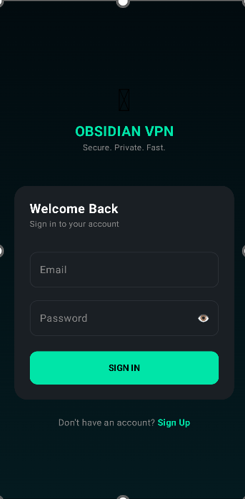
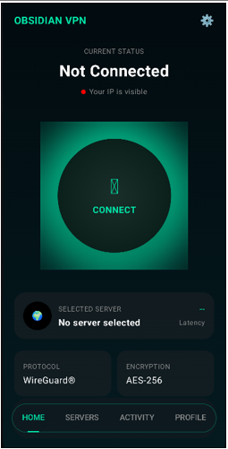
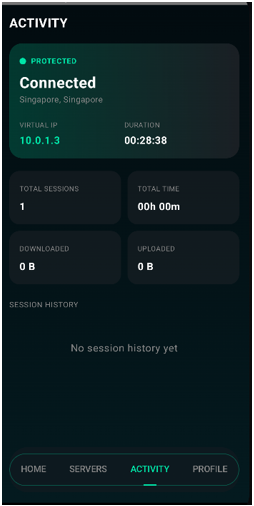
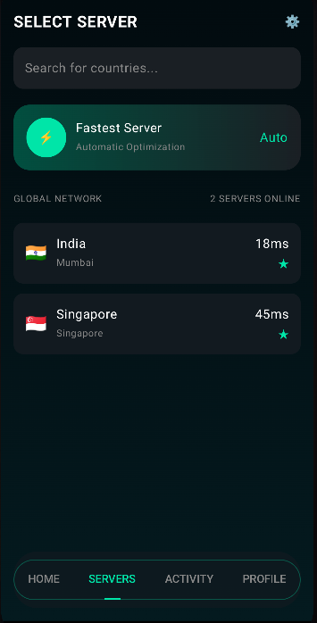
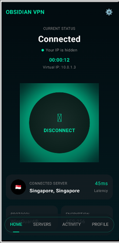
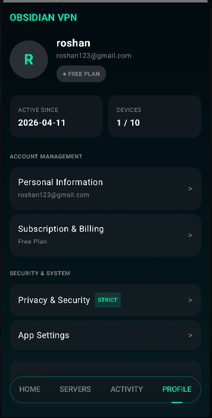

# 🛡️ Obsidian VPN

> **Secure. Fast. Private. Cloud-powered VPN using WireGuard and AWS.**

---

## 🚀 Overview

**Obsidian VPN** is a high-performance, secure Virtual Private Network (VPN) application built using modern Android technologies and cloud infrastructure. It ensures **encrypted communication, privacy protection, and low-latency connectivity** using the **WireGuard protocol** and **AWS EC2 servers**.

This project demonstrates real-world implementation of **secure networking, cloud deployment, and modern UI development**.

---

## ✨ Features

* 🔐 Secure VPN connection using **WireGuard**
* ⚡ High-speed, low-latency networking
* ☁️ Cloud-hosted servers using **AWS EC2**
* 📱 Modern Android UI built with **Jetpack Compose**
* 🔑 User authentication interface
* 🌐 Encrypted data transmission & IP masking
* 🔄 Easy connect/disconnect functionality

---

## 🧠 Tech Stack

| Category     | Technology Used             |
| ------------ | --------------------------- |
| Frontend     | Kotlin, Jetpack Compose     |
| Backend      | AWS EC2 (Ubuntu Server)     |
| VPN Protocol | WireGuard                   |
| Networking   | UDP-based tunneling         |
| Tools        | Android Studio, AWS Console |

---

## 🏗️ System Architecture

```
User (Android App)
        ↓
VPN Tunnel (WireGuard - Encrypted)
        ↓
AWS EC2 Server (Ubuntu)
        ↓
Internet
```

> The application establishes a secure encrypted tunnel between the client device and the cloud server, ensuring data confidentiality and anonymity.

---

## 📸 Screenshots

### 🔐 Login Screen


### 🏠 Home Screen


### 📊 Activity Screen


### 🌐 Server Selection Screen


### 🔌 Connection Screen


### 👤 Profile Screen



---

## ⚙️ Installation & Setup

### 📱 Android App

1. Clone the repository

```bash
git clone (https://github.com/oza24/Obsidian-VPN.git)
```

2. Open in **Android Studio**

3. Build and run on emulator/device

---

### ☁️ AWS Server Setup

1. Launch EC2 instance (Ubuntu)
2. Connect via SSH
3. Install WireGuard:

```bash
sudo apt update
sudo apt install wireguard
```

4. Configure `wg0.conf`
5. Enable IP forwarding
6. Start VPN:

```bash
sudo wg-quick up wg0
```

---

## 🔐 Security Implementation

* End-to-end encryption using WireGuard
* Secure key-based authentication
* IP masking for anonymity
* Firewall and routing configuration on AWS

---

## 📊 Results

* ✅ Stable VPN connection
* ⚡ Low latency and fast speed
* 🔐 Secure encrypted traffic
* 📱 Smooth UI performance

---

## 🚀 Future Improvements

* 🌍 Multi-server support
* 🤖 AI-based threat detection
* 📊 Real-time analytics dashboard
* 📱 Cross-platform (iOS/Web)
* 🔄 Auto server selection

---

## 📚 References

* WireGuard Documentation
* AWS EC2 Documentation
* Android Developer Documentation

---


## 📬 Contact

**Your Name**
📧 [vilasoza19@gmail.com](mailto:vilasoza19@gmail.com)
🔗 LinkedIn: [https://linkedin.com/in/your-profile](https://www.linkedin.com/in/vilas-oza-680ab5295/)

---

⭐ If you found this project useful, give it a star!
